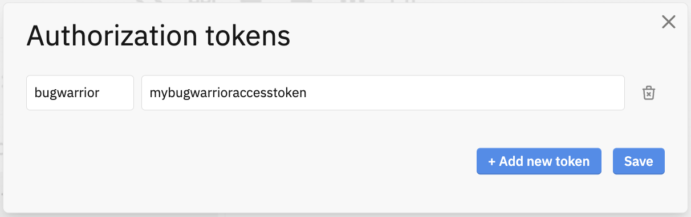

Logseq
======

You can import `tasks <https://docs.logseq.com/#/page/tasks>`_ from `Logseq <https://logseq.com/>`_ using the ``logseq`` service name.

Additional Requirements
-----------------------

To use bugwarrior to pull tickets from Logseq you need to enable the Logseq HTTP APIs server.
In Logseq go to **Settings** > **Features** and toggle the **HTTP APIs server** option.

Next select the **API** option in the top menu to configure authorization token, e.g

Example Service
---------------

Here's an example of a Logseq target:

.. config::

    [my_logseq_graph]
    service = logseq
    logseq.token = mybugwarrioraccesstoken

The above example is the minimum required to import issues from Logseq.
You can also feel free to use any of the configuration options described in
:ref:`common_configuration_options` or described in `Service Features`_ below.

Service Features
----------------

Host and port
+++++++++++++

By default the service connects to Logseq on your local machine at `localhost:12315`. If you have
Logseq on another host or using a different port you can change the setting using:

.. config::
    :fragment: logseq

    logseq.host = anotherhost.home.lan
    logseq.port = 12315

Authorization Token
+++++++++++++++++++

The authorization token is used to authenticate with Logseq. This value is required and must match
the one of the authorization tokens set in Logseq HTTP APIs server settings.

.. config::
    :fragment: logseq

    logseq.token = mybugwarrioraccesstoken

Task filters
++++++++++++

You can configure the service to import tasks in different states.
By default the service will import all tasks in an active tasks states

    DOING, TODO, NOW, LATER, IN-PROGRESS, WAIT, WAITING

You can override this filter by setting the ``task_state`` option to a 
comma separated list of required task states.

.. config::
    :fragment: logseq

    logseq.task_state = DOING, NOW, IN-PROGRESS

Task state and data/time mappings
+++++++++++++++++++++++++++++++++

``DOING``, ``TODO``, ``NOW``, ``LATER``, and ``IN-PROGRESS`` are mapped to the default ``pending`` state.
The Logseq task ``SCHEDULED:`` and ``DEADLINE:`` fields are mapped to the ``scheduled`` and 
``due`` date fields.

``WAITING`` and ``WAIT`` are dynamically mapped to either ``pending`` or ``waiting`` states based on 
the ``wait`` date. The ``SCHEDULED:`` date or ``DEADLINE`` date is used to set the ``wait`` date on the
task. If no scheduled or deadline date is available then the wait date is set to ``someday`` 
(see ``Date and Time Synonyms <https://taskwarrior.org/docs/dates/#synonyms-hahahugoshortcode30s0hbhb/>``_).
Future dated waiting tasks can be listed using ``task waiting``

``DONE`` is mapped to the ``completed`` state.

``CANCELED`` and ``CANCELLED`` are mapped to the ``deleted`` state.

Priority mapping
++++++++++++++++

Logseq task priorities ``A``, ``B``, and ``C`` are mapped to the taskwarrior priorities
``H``, ``M``, and ``L`` respectively.

Character replacement
+++++++++++++++++++++

This capability is in part to workaround ``ralphbean/taskw#172 <https://github.com/ralphbean/taskw/issues/172>``_
which causes the ``[`` and ``]`` characters commonly used in Logseq to be over escaped as ``&open;`` and ``&close;``
when they are synced using bugwarrior.

To avoid display issues ``[[`` and ``]]`` are replaced by ``【`` and ``】`` for page links, and single
``[`` and ``]`` are replaced by ``〈`` and ``〉``. 

You can override this default behaviour to use alternative custom characters by setting the ``char_*`` options.

.. config::
    :fragment: logseq

    logseq.char_open_link = 〖
    logseq.char_close_link = 〗
    logseq.char_open_bracket = (
    logseq.char_close_bracket = )

Logseq URI links
++++++++++++++++

A ``logseq://`` URI is generated for each task to enable easy navigation directly to the specific task in
the Logseq application. 

By default bugwarrior incorporates the links into task description. To disable this behaviour either 
modify the ``inline_links`` option in the main section to affect all services, or to modify for the logseg sevice only you can 
set it in your Logseq section.

.. config::
    :fragment: logseq
    
    logseq.inline_links = False

Unlike regular ``http://`` links, most terminals do not make application specific URIs clickable. 
A simple way to quickly open a a task in Logseq from the command line is to add a helper function to your 
shell that extacts the Logseq URI and opens it using the system specific launcher. For example, to open the
Logseq URI in MacOS add the following to your ``~/..zshrc``

.. code-block:: bash

    # open a specific taskwarrior task in Logseq
    function taskopen() {
        open $(task $1 | grep "Logseq URI" | sed -r 's/^Logseq URI//')
    }

From the command line you can open a specific task using taskwarior task id, e.g. ``taskopen 1234``.

Tags
++++

LogSeq tasks with ``#tag`` style tag entries in the description are added to the Taskwarrior tags.
Multi and single word tags using the Logseq ``#[[Tag]]`` or ``#[[Multi Word]]`` format are
condenced to a ``#Tag`` and ``#MultiWord`` style before adding the Taskwarrior tags. The format of 
the tag content in task desciption is unchanged.

Troubleshooting
---------------

Logseq graph re-index
+++++++++++++++++++++

If you re-index your Logseq graph all task ids and uuids are changed. The next time
you run bugwarrior all existing taskwarrior tasks will be closed and new ones will 
be created.

Logseq API connection issues
++++++++++++++++++++++++++++

If you get the following error when running bugwarrior:

    CRITICAL:bugwarrior.services.logseq:Unable to connect to Logseq HTTP APIs server. HTTPConnectionPool(host='localhost', port=12315): Max retries exceeded with url: /api (Caused by NewConnectionError('<urllib3.connection.HTTPConnection object at 0x105764f20>: Failed to establish a new connection: [Errno 61] Connection refused'))

- Check that the LogSeq application is running
- Check that the HTTP APIs server is started
- Check that authorization token is set in the API server settings and matches the 
  ``token``.

Provided UDA Fields
-------------------

.. udas:: bugwarrior.services.logseq.LogseqIssue
